# Sweet Croí

Sweet Croí is a website for a small Irish bakery that specializes in macaroons and cupcake bouquets that allows users to view a menu and get a quote for the products that Sweet Croí offers.

View the live site [https://janisroz.github.io/sweet-croi/](https://janisroz.github.io/sweet-croi/).

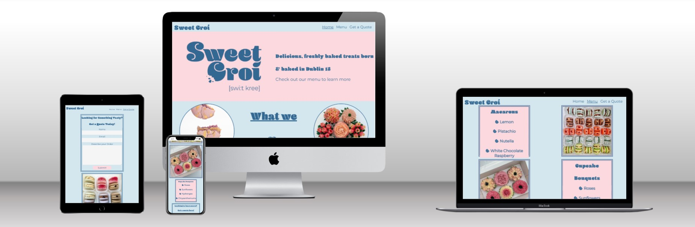

## Features

### Site Wide

- Nav Bar
  - Contains links to the Home, Menu and Get a Quote pages and is responsive on all devices
  - Allows for easy navigation across all pages of the website

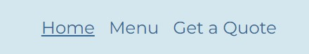

- Logo Link
  - A basic logo that links back to the Home page of the website from any location

- Footer
  - Contains social media links via the respective logos to the Facebook and Instagram pages of the business
  - Opens the links in new tabs for user friendliness
  - Are accessible to screen reader users through aria labels.

### Home Page

- Hero image and Description
  - This section contains an image of the Sweet Croí logo and also a brief description of what the company is.
  - Allows users to understand the purpose of the website.

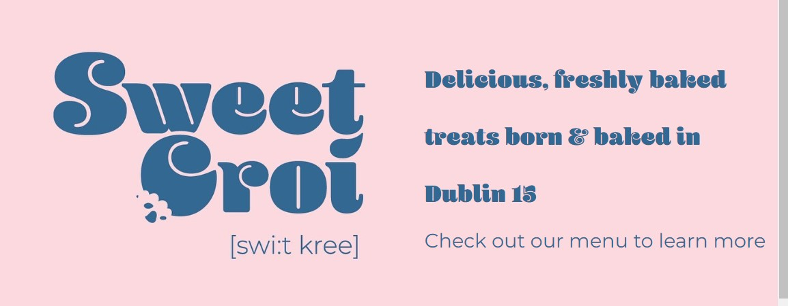

- What We Offer
  - This section contains two images and text in the middle showing users what the business offers.
  - This sections all links to the menu page of the website.
  - When a user hovers over the images overlay text will appear describing the image contains.
  - As screen sizes decrease the text that appears on hover will appear permanently.

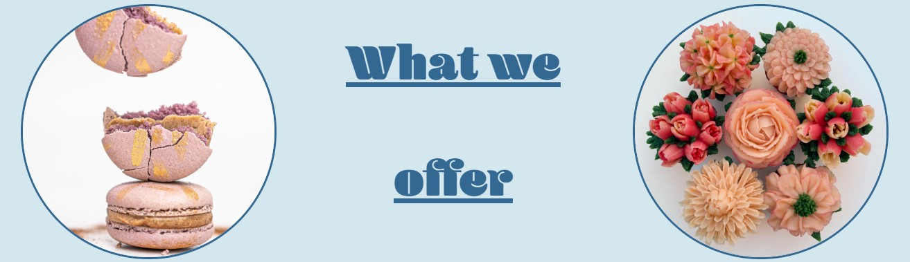

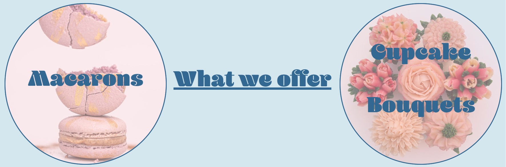)

- Get a Quote
  - This section contains text that links to the get a quote website allowing users who are looking for more information to easily get in touch

### Menu Page

- Menu Section

  - The purpose of this section is to offer users a location to view the products offered by the bakery consisting of macarons and cupcake bouquets, and the flavors/types offered.
  - As the page scales down the tiles change from a row to a column orientation

  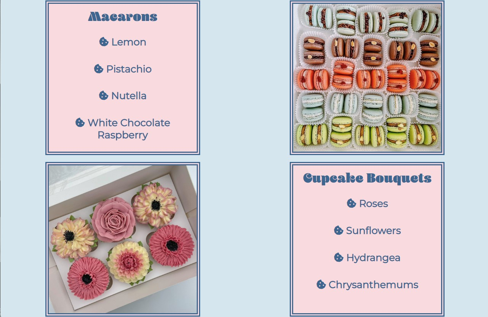

  - Get a Quote
  - This section contains text that links to the get a quote website allowing users who are looking for more information to easily get in touch

### Quote Page

- This page contains a form that allows users to describe their order requirements and request a quote for the order.
- When the submit button is clicked the page wil navigate to recieved.html informing the user that we have recieved the submission and will be in touch ASAP
  - It will consist of the following fields:
    - Name (type: text, required)
    - Email (type:email, required)
    - Describe your orderv(type: textarea, required)

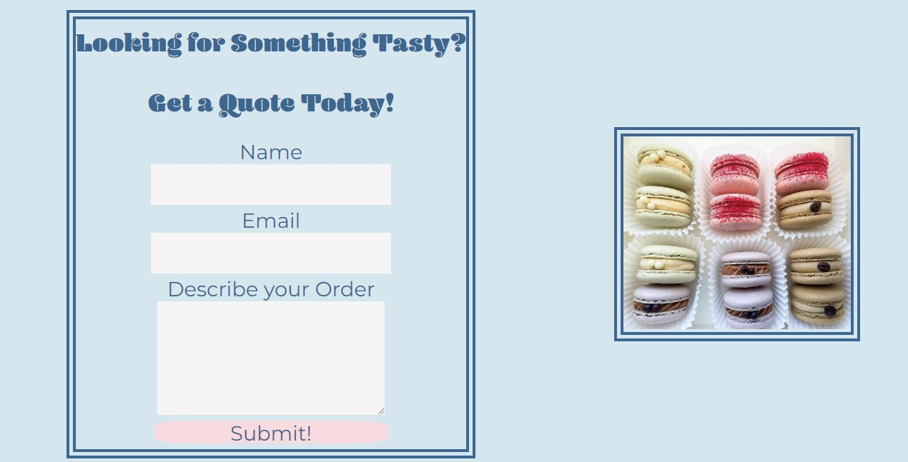

### 404 Page

- This page was implemented to ensure that if a user follows a broken link they will easily be able to navigate back to their required page without using browsers back button

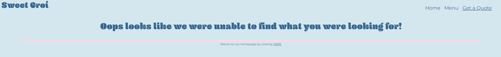

### favicon

- A favicon of the Sweet Croí logo was added to all pages in order to allow users to easily spot the website tab when multiple browser tabs are open

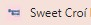

## Existing Features

- Responsive design
- Overlay text appearing on hover
- Quote form with success page
- Menu page showcasing products

## Features for Future Implementation

- The quote form could be made to send an email to the business owner informing them of the information provided by the user
- The menu page could be updated to have a sliding gallery of images rather than single images

## Technologies

- HTML

  - Website structure and contact was developed using HTML

- CSS

  - Website styling, design and responsiveness was developed using CSS

- FontsFree

  - <https://fontsfree.net/> was used to download the Blenny font that was used for the headings throughout the site

- Font Awesome

  - <https://fontawesome.com/> was used for the social media icons in the footer and for the menu bullet points

- Favicon.io

  - <https://favicon.io/> was used to create the favicon image

- Code Anywhere

  - Code Anywhere was used as the IDE to develop the website

- GitHub

  - GitHub was used to store the source code and also deploy the website on Git Pages

- Git
  - Was used to commit and push code throughout development

## Testing

### Responsiveness

All pages were tested to ensure that the website remains responsive on all browsers and devices starting from screen sizes of 280px wide and upwards. The website was tested on Chrome, Firefox, Edge and Opera browsers.

How to test:

1. Open desired browser and go to SWEET CROI [Link](https://janisroz.github.io/sweet-croi/)
2. Open developer tools by right clicking and selecting inspect
3. Click responsive button and lower width to 280px
4. Increase width by dragging the edge of window to max width

Expected:
The website responds responsively without horizontal scroll bars appearing or any elements overlapping.

Result:
The website remained responsive throughout all tests.

The website was also tested on:

1. Iphone 11 Pro
2. Iphone 11 Max
3. Samsung S22 Ultra
4. Oneplus Nord

### Accessibility

[Wave Accesibility Tester](https://wave.webaim.org/) was used to test the accessibility of the web page in order to ensure that the website was fully accesible for all aids.

Testing ensured that all followinf criteria were met:

- All headings were used appropriately and not forgotten about or skipped
- That contrast was appropriate allowing for users to easily see different sections and differentiate text
- Aria labels were used correctly
- That the page is ordered and sectioned appropriately in order to ensure that screen readers can navigate through the page comfortably
- All non-text items are properly labeled allowing screen readers to read them
- All form elements have corresponding labels allowing screen readers to read them

## Functional Testing

### Navigation Links

Testing was performed in order to confirm all navigation links across the website were in working order and linking to correct page.

All links on the page were working correctly see below for list of tested links:

| Link        | Page to Load |
| ----------- | :----------: |
| Home        |  index.html  |
| Menu        |  menu.html   |
| Get a Quote |  quote.html  |

### Form Testing

All form elements were tested to insure that they were producing expected results.

- Firstly the form was tested with all inputs added correctly
  - Name: Janis
  - Email: test@gmail.com
  - Describe your Order: Tasty One

When submit was clicked user was redirected to form-success.html as expected

- Next the name field was left out Email & Describe your Order remained the same

When submit was clicked user was informed that the name field was required

- Next the email field was inputted as jack.com, this format did not match what is required as an email field, Name & Describe your Order remained the same as in first test

When submit was clicked user was informed that the email field required the correct format of text@text.text

- Next the Describe your Quote field was left empty, Name & Email remained the same as in first test

When submit was clicked user was informed that the Describe your Quote section was required

### Footer

- Testing was performed on both the Facebook and Instagram links insuring that they are opening in new tabs
- Both links opened new tabs on the expected pages

## Validator Testing

### HTML

- No errors were found when tested by the official [W3C validator](https://validator.w3.org/)

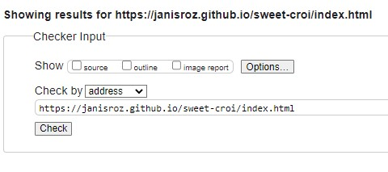

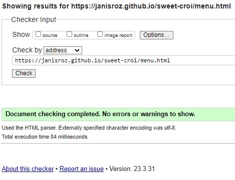

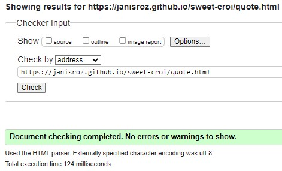

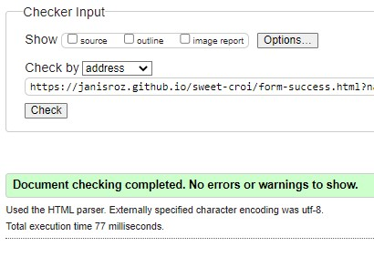

### CSS

- No errors were found when tested by the official [Jigsaw CSS validator](https://jigsaw.w3.org/css-validator/)

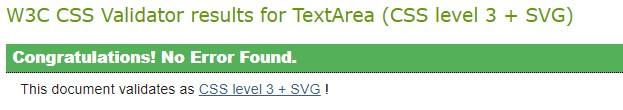

## Deployment

### Version Control

The website was created using the Code Anywhere IDE and was pushed to the github repository "sweet-croi".

Git commands were used to push code to the remote repositort:

- `git add <file>` was used to add a file or multiple files to the staging area
- `git commit -m "commit detail"` was used to commit changes to the local repository queue before being pushed to github
- `git push` was used to push all commited code and files to the repository on gihub

### Deployment to Github Pages

Github pages was used to deploy the website.
Steps to deployment are as follows:

- Click on the settings button within the required repo
- Click on the "Pages" tab in the settings page in the menu on the left
- Select "main" branch from the branch dropdown menu
- Click "Save"
- The link will appear at the top of the page once the website is deployed

The live website can be found here: [https://janisroz.github.io/sweet-croi/index.html](https://janisroz.github.io/sweet-croi/index.html)

### To Clone the Repository Code Locally

- Begin in the required repository
- Click on the green code drop down button and select local
- Copy the repository link to the clipboard
- Using an IDE with pre-installed git type `git clone copied-git-url` into the IDE terminal
- The project will now be cloned on your IDE to use

## Credits

- favicon steps were taken from the DeeMc youtube channel- [https://www.youtube.com/watch?v=W809I-d9xTg&ab_channel=DeeMc](https://www.youtube.com/watch?v=W809I-d9xTg&ab_channel=DeeMc)

### Content

All images were taken from the Sweet Crpo instagram page owned by the business owner. Permission was granted before use of any images

### Final Notes

Some vague commits regarding the README updates can be found due to updating on the github website and these commits were auto-generated.
Once was made aware that commits needed to be more specific this was addressed
